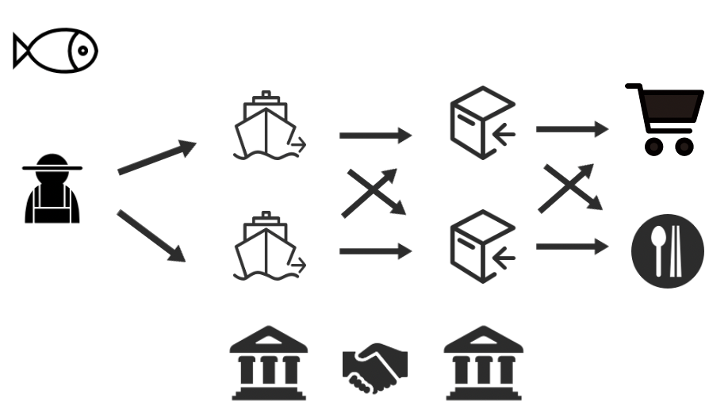
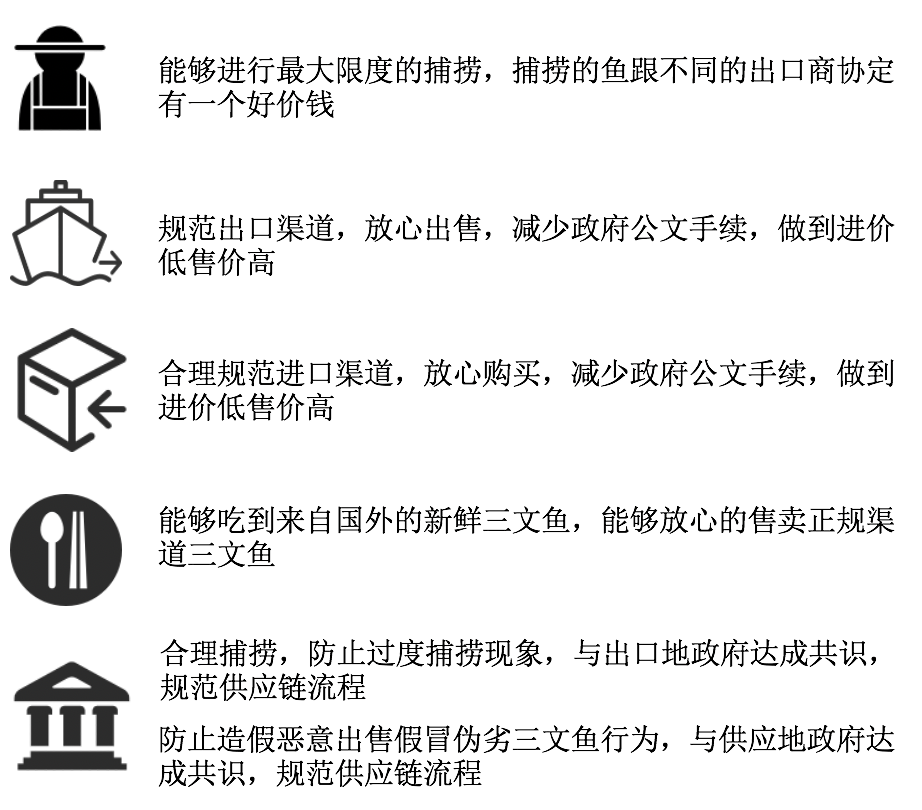
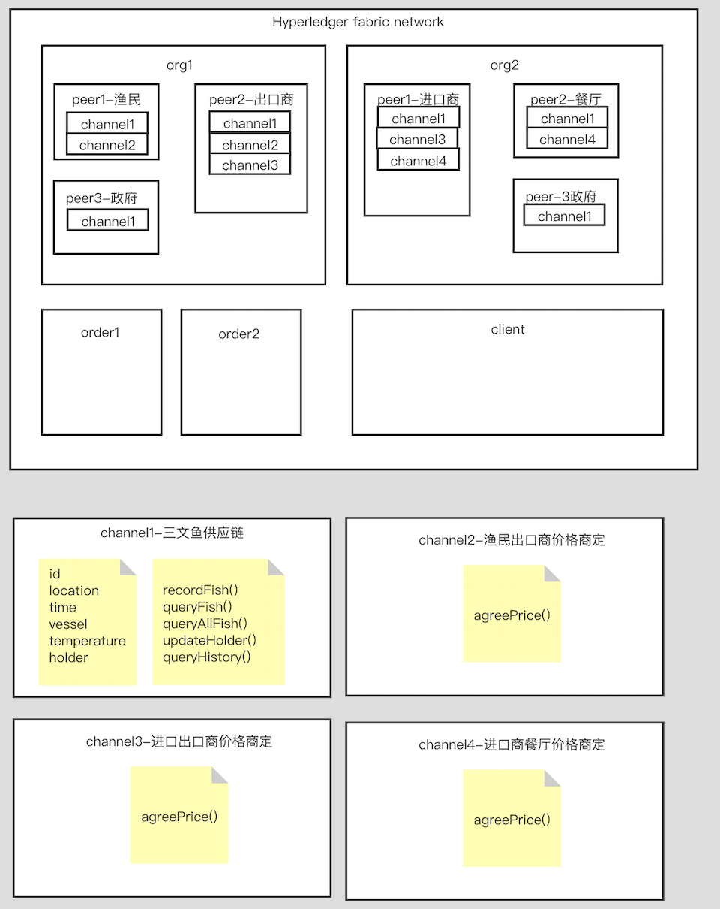
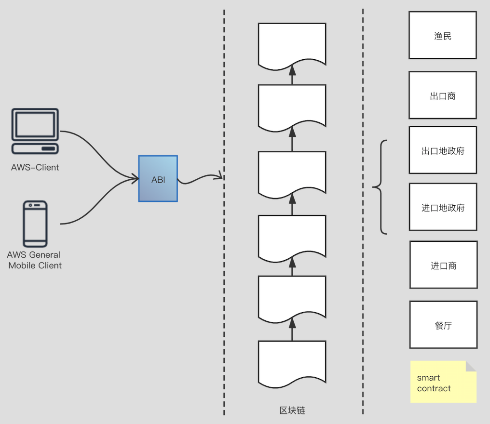

# fabric-fish

### 背景

1、区块链技术作为一种分布式的数字账本技术，保证了透明性、可追溯性和安全性，有望缓解一些全球供应链管理问题。本项目以该背景下完成三文鱼供应链的开发鱼部署，包含供应两国的6个关键参与者之间的三文鱼流通。

2、流程如下所示：



3、各主要干系人的需求如下：



### 基础架构

1、网络架构如下所示，该网络架构为Hyperleder fabric网络结构，org1、org2分别为两个组织代表两个国家，分别为出口国与进口国。在org1中，分别有渔民、出口商、政府，其中政府为锚节点，用于在两个互不信任的网络之间通信；在org2中有进口商、餐厅、政府，同样的政府为锚节点。图示中，每个节点都含有channel1，用于查看三文鱼的供应情况，三文鱼的具体信息包括：捕捞的id、捕捞地点、捕捞时间、捕捞船只、捕捞运输温度、当前所有者，该网络结构中每个人都能查看三文鱼的情况，除此之外，渔民能够添加三文鱼。此外，为了保证信息的保密性，各个交易双方之间含有一个channel进行沟通价格。




2、架构图如下所示，背后的渔民、出口商、进口商、当地政府、餐厅根据智能合约的约束形成一条三文鱼的交易链，这个链是公开的，普通消费者可以通过终端查看自己吃的三文鱼是怎么一步一步走到自己的餐桌上。图中账本数据全部储存在各节点的**couchdb**中。




### 目录结构

```shell
├── README.md
├── bin    # 按照fabric安装教程下载的bin
├── chaincode    # 链码 
│   └── fishcc
├── config # 按照fabric安装教程下载的config
│   ├── configtx.yaml
│   ├── core.yaml
│   └── orderer.yaml
├── fish-web   # 前端页面
│   ├── README.md
│   ├── node_modules
│   ├── package-lock.json
│   ├── package.json
│   ├── public
│   └── src
├── fishnetwork  # 存放网络
│   ├── basic-network   # 一个org一个peer
│   ├── config
│   ├── fish-network   # 上述架构
│   ├── webapp        # 对应basic-network启动
│   └── webapp-tls    # 对应fish-network启动
└── images

```

### 链码结构

> 首先要执行npm install才能运行

- [代码地址](https://github.com/zhangfuli/fabric-fish/blob/master/chaincode/fishcc/index.js)
- Init：用于初始化链码
- Invoke：为调用链码函数提供统一入口
- initLedger：初始化数据
- recordFish：记录三文鱼（id，holder，location，temperature，vessel，time）
- queryFish：查询单条鱼的信息（id）
- queryAllFishes：查询所有鱼的信息
- updateHolder：更新拥有者（id，newHolder）
- queryHistory：查询某批鱼的历史拥有记录（id）

### Node SDK说明

- query.js----对链码函数queryFish、queryAllFishes、updateHolder的封装
- invoke.js----对链码函数recordFish、updateHolder的封装
- 两个js只需更改一个地方

```javascript
        //更改这里
        const request = {
            chaincodeId: chaincodeId,
            fcn: fcn,
            args: args
        };
```

- **webapp-tls中sdk包含tls认证，webapp中sdk不包含tls认证**

### 运行说明

- 首先在basic-network网络中进行链码调试、node-sdk调用调试、前端调试，之后再更换fish-network网络
- webapp对应basic-network，单组织单节点，**不含tls认证**，为调试用网络
- webapp-tls对应fish-network，上述架构，**包含tls认证**，为最终发布版本
- webapp或webapp-tls下运行如下脚本启动网络（根据情况选其一）
  - startFabric-basic.sh----启动basic-network，并安装链码，启动脚本测试
  - startFabric-fish.sh----启动fish-network，并安装链码，启动脚本测试
  - startFabric-network.sh----仅仅启动basic-network
- Node SDK
  - npm install 安装依赖文件
  - node enrollAdmin.js， 创建管理员
  - node registerUser.js创建用户
  - node invoke.js, 调用函数
  - node query.js, 查询记录
- 启动后端转发：node app.js

### 遗留Bug

- **org1peer0**节点不能对链码实现增加三文鱼记录、更换三文鱼拥有者以及查询的相关操作
- 只生成了一个用户peer1org1，一个org1的admin
- 未编写协商价格的channel

### 版本及部署说明

- [fabric-1.4.0](https://hyperledger-fabric.readthedocs.io/en/release-1.4/whatis.html)
- [手动搭建fabric]([https://zhangfuli.github.io/2020/03/29/%E6%89%8B%E5%8A%A8%E6%90%AD%E5%BB%BAhypeledger-fabric/](https://zhangfuli.github.io/2020/03/29/手动搭建hypeledger-fabric/))
- [Node SDK 安装说明](https://zhangfuli.github.io/2020/04/07/fabric-node-sdk-1-4-0/)
- [测试链码，fabric开发者模式]([https://zhangfuli.github.io/2020/04/02/fabric%E5%BC%80%E5%8F%91%E8%80%85%E6%A8%A1%E5%BC%8F/](https://zhangfuli.github.io/2020/04/02/fabric开发者模式/))
